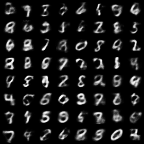
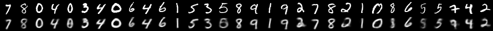
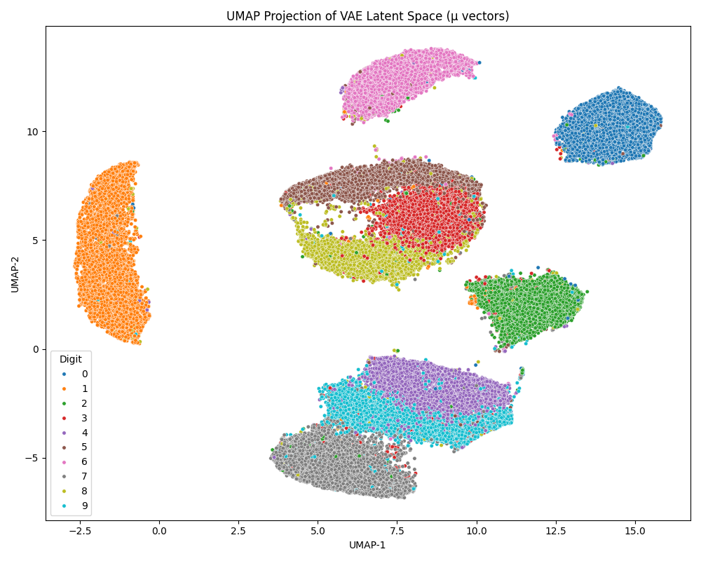

# 🧠 Basic Variational Autoencoder (VAE) on MNIST

Variational Autoencoder (VAE) — starting with the classic MNIST dataset and ending with a fresh appreciation for how generative models can inform biology, disease modeling, and cell state transitions.

## 💡 What This Project Is
This repository contains a clean implementation of a VAE trained on MNIST handwritten digits. I used it to:

- Build intuition around probabilistic generative models
- Understand latent spaces and how they represent compressed data
- Learn how to sample, interpolate, and visualize what a model “believes” a digit looks like
- Reflect on how these concepts translate to biological applications like single-cell analysis

---

## 🌟 Key Analyses & Results

### 1. Generated Digits  
Sampled from the standard normal distribution in latent space:

### 2. True-Digit Reconstructions  
Decoded from the `μ` vectors of real MNIST images:

### 3. Latent Space Visualization (UMAP)  
UMAP was used to reduce the 20-dimensional latent space to 2D. Each point represents a digit's encoded mean (`μ`), revealing natural clustering by digit class:

---

## 🧪 Reflections: From MNIST to Cells
Working on this project made something click for me:

The same way we interpolate between a "3" and an "8" in latent space, we can imagine interpolating between two biological cell states — say, a healthy cell and a diseased one.
This is the exact principle behind tools like scVI and scGen, which use VAEs to model:

- Cell type identity
- Treatment response
- Disease progression
The latent space in a VAE becomes a map of possibilities — not just of digits, but of biological identities and potential outcomes. That’s incredibly exciting as a bioinformatician.

## 🚀 Next Steps
This project is just the beginning. I'm planning to:

Extend this to β-VAEs for disentangled representations
Try conditional VAEs (CVAE) to generate digits of a specific class
Apply a similar architecture to gene expression and molecular data
